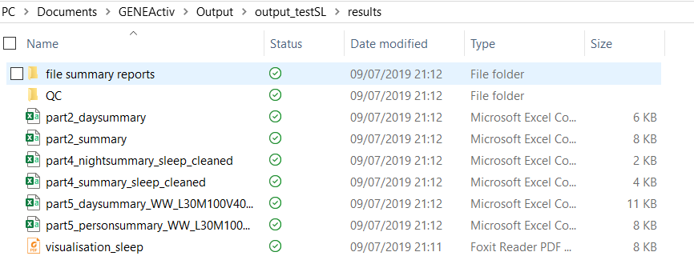
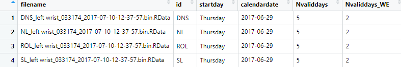
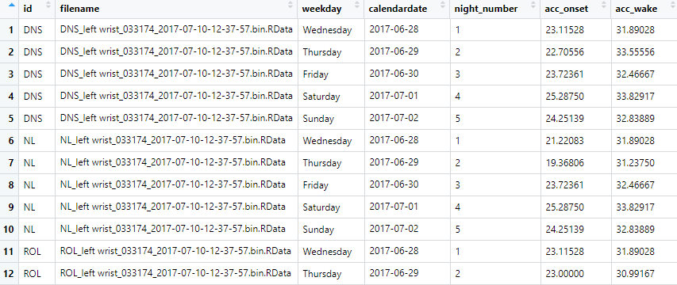

## Installing easyGGIR

To install a package from github, first make sure the `devtools` package is installed and loaded. 

```{r package_install, eval=FALSE}
library(devtools)
```

Then you can use the `install_github` function to install the package.

```{r, eval=F}
install_github("amyr-hodgson/easyGGIR")
```

## `combine_summary` and `combine_daily`

When you have run analysis of your actigraphy data using GGIR, you end up with a folder for each participant, containing several csv files full of data, as shown below. 

```{r, echo=FALSE}
library(knitr)

```

However, most people want data from all particpants in one dataset. These functions are designed to save time by creating a single dataset for each output part (i.e. part 2, 4, and 5) containing data from all participants. 

### `combine_summary`

This function takes the 'summary' parts of the GGIR output and combines them. It takes two arguments: the filepath to the folder containing all of your output, and the part of the output you want (2, 4, or 5). I recommend having all your output from all participants in a single folder, and setting your working directory to the directory containing this folder. 

In this example, the folder is named 'Output' and we are interested in the data produced in the part 5 summary.

```{r, eval=FALSE}
mydata <- combine_summary(filepath = "Output", part = 5)
```
```{r, echo=FALSE}

```

You can then conduct your analysis in R. Alternatively you can make a new csv file with the output, e.g. `write.csv(mydata, file = "mydata.csv")`.

### `combine_daily`

This function works in exactly the same way as `combine_summary`, but works for the daily output parts- i.e. part2_daysummary, part4_nightsummary and part5_daysummary.

```{r, eval=FALSE}
mydata <- combine_daily(filepath = "Output", part = 5)
```
```{r, echo=FALSE}

```


### Why is there no option to create a single dataset with all output parts?

Due to the high number of variables produced in the output (~500 in total, if all parts are combined), and inconsistencies between different parts of the output, I decided to combine different output parts seperately. However, if you want a single dataset, the `dplyr` package has tools to do this fairly easily. 
